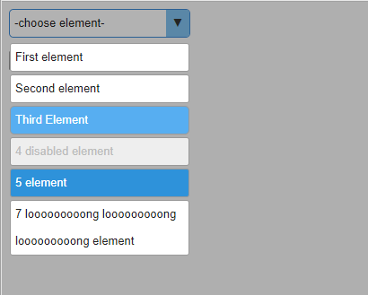
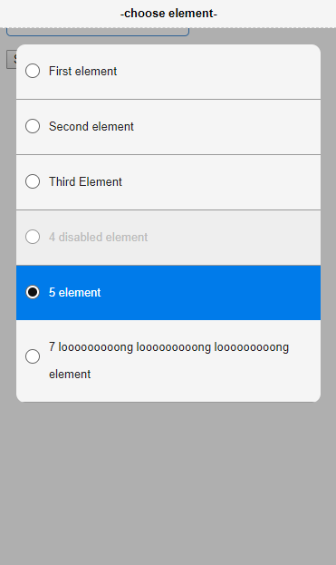

## Full custom select with options on HTML + CSS.

The HTML element "select" is implemented using html + css. The element is based on input [type = 'radio'].
And toggle the "show / hide" property is implemented using the "tabindex" attribute.

**No JavaScript. No rerender after dynamically DOM update. No "jump" height in text-container on loading.**

Now you can design the select and options very easily.

### Demo

Demo page: https://asknn.github.io/custom-select-without-js/custom-select

### Screenshots

### Browser support

* Firefox
* Opera
* Chrome
* Internet Explorer 11
* Microsoft Edge
* Safari 9 (with enable JS)
* Android Browser
